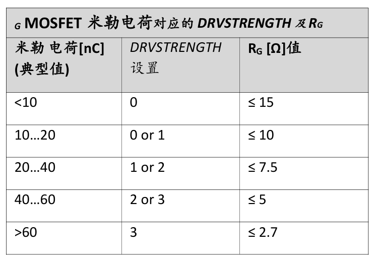

# ELACO_StepMotorTMC5160

## 这是一个基于TMC5160的步进电机驱动项目

其中包含了原理图PCB以及源代码。

电机型号：[57CME13步进电机*闭环步进电机*雷赛商城](https://www.leisaishop.com/product/productinfo_id=44.html)
驱动器参数：[CL1-507闭环步进驱动器_闭环步进驱动器_雷赛商城](https://www.leisaishop.com/product/productinfo_id=18.html)

## 关于原理图设计

1. **一般我们会设计VSA与VS电源由一路供电,这样是最安全的**，但是如果VS的电源超过了24V就不建议一路供电了，这时VSA应该使用单独的开关电源转换过来的电压进行供电，并且要保证在电机运行期间VSA不会跌落，正常如果要断VSA的电前应该先关断电机驱动(DRV_ENN脚拉高)。、
2. 如果电机的输入电压允许12V的话，或者电机运行电压非常大的话，建议**使用DCDC转换为12V给VSA和12VOUT供电**（这时12VOUT内部的LDO可以直接不工作，进而会减少功率的损耗以及发热问题）
3. MOS管的选型上
   1. 将MOSFET调整到所需的电机电压(在峰值电源电压上增加5-10V的余量)和所需的最大电流，使得电阻功耗对于所选MOSFET封装的热容量仍然很低。
   2. 管子Vth选择10V内的（主要因为芯片驱动电压在10V左右）
   3. 对于选型好mos以后栅极电阻的选择，根据米勒电荷对阻值进行选择（同时还要考虑软件上的驱动电流设置DRVSTRENGTH）
   
   4. 对于驱动电阻，如果驱动电阻的电阻超过表中给出的值时可以增加一个反向二极管（负极对驱动芯片）以增加开关速度。
   那么根据以上条件，我的mos选择AOD4126的米勒电荷是10nC(VGS=10V, VDS=50V, ID=20A),那么我的栅极电阻选择就是10R左右，驱动电流设置就是0/1。（此外我还加入了4148，以求更快的开关速度）
4. 

## 关于PCB布线

1. 将采样电阻和所有滤波电容尽可能靠近功率MOSFET。TMC5160靠近MOSFET放置，短线互连，以最小化寄生电感。
2. 将所有的GND、GNDA、GNDD及采样电阻GND连成一个公共地。
3. 5VOUT滤波电容直接连到5VOUT和GNDA引脚。
4. 需要做好对于芯片TMC5160的散热处理，特别是在MOSFET栅极电荷高、斩波器频率高或系统时钟频率大于12MHz的情况下，内部的LDO功耗较大。

## 当前状态：

### 2026.07.10

- [ ] 测试编码器数据是否正常
- [ ] 测试芯片接收编码器信号是否正常
- [ ] 测试freemodbus
- [ ] 测试驱动器IC在其BM引脚到地没有出现低于-5V的峰值，避免芯片。（电机正反转下测试）如果超过了要添加对地的TVS二极管保护

### 2026.07.09

- [x] 修改采样电阻为0.05R / 1W电阻，然后开启速度模式，测试电机转动 -- 上班时间最后一刻上电发现电机转动了。

**目前存在的一些问题：**

1. 改了采样电阻，但是依旧无法转动电机。MOS管上管的栅极电压为24V，下管栅极电压为0V。没有PWM波，或许要先看一下电路设计有没有问题先。

## 2026.07.08

- [x] 修改CE3电容的PCB封装
- [x] 查看example内的文件内容(关于tmc5160的)
- [x] 对TMC5160的SPI进行配置和通讯 -- 实现SPI的读写
- [x] 测试TMC_CLK脚的PWM输出是否是14Mhz的（芯片手册要求是10-16Mhz的方波）-- 84Mhz,psc=0,arr=5 14Mhz刚好

**目前存在的一些问题：**
1. Q2和Q4在不接芯片和门极电路的情况下自己导通然后烧掉了（应该是我把mos的栅极悬空的原因）
2. 修改BOM，修改采样电阻为0.05R / 1W电阻，然后开启速度模式，测试电机转动
3. modbus测试不成功

### 2026.07.07

- [x] 移植freemodbus
  配置一个串口（开启串口中断），配置一个定时器（开启定时器中断）
  移植freemodbus的文件入项目
  分别修改port.c，portserial.c和porttimer.c文件内容
- [x] 增加freemodbus移植内容以及测试函数。（测试函数也可以作为一个example来看）
- [x] 做了移植，但还未测试
- [x] 对CAN进行了测试

**目前存在的一些问题：**

1. freemodbus没有测试
### 2026.07.06

- [x] 焊接硬件

**目前存在的一些问题：**
1. CE3电容的PCB封装有点问题，正负极反了 (✅封装已修改)